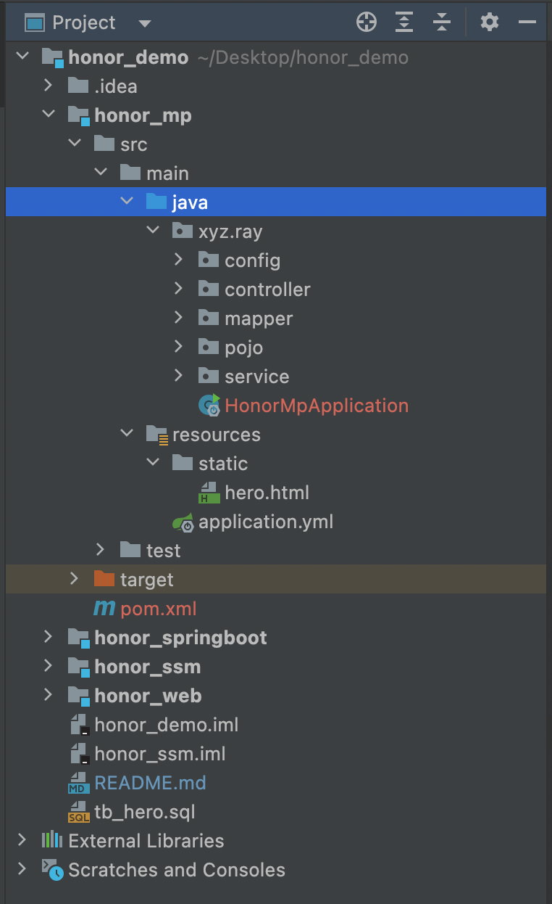
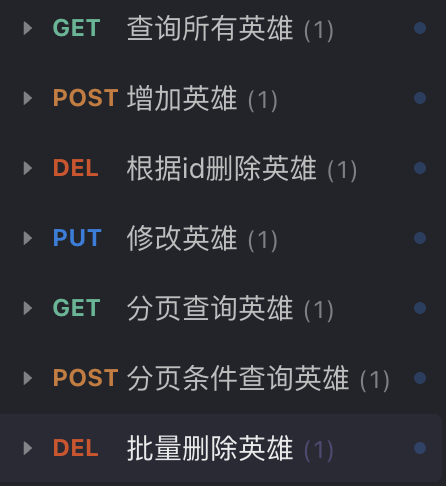
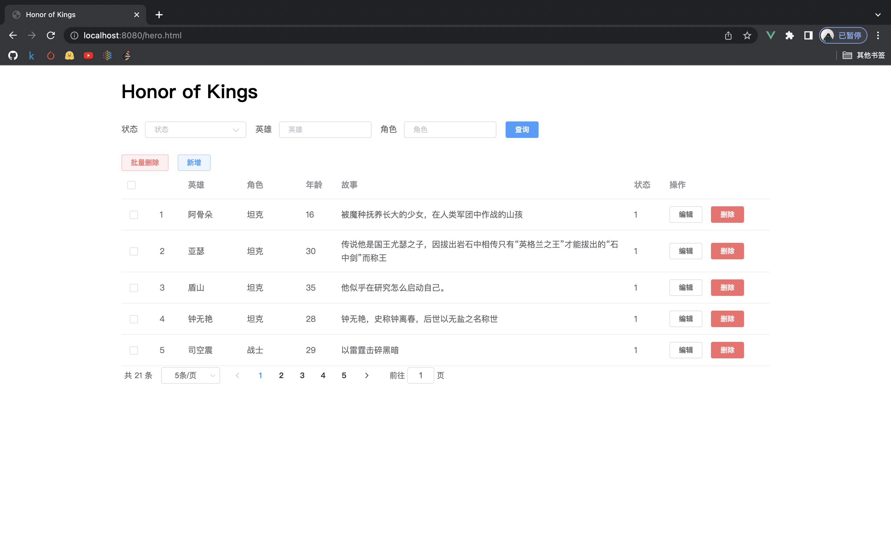

# hero
一个王者荣耀英雄信息管理系统的 demo

## 1、项目技术

此项目的 前端技术 `Vue2.x` + `ElementUI`

四个模块分别由以下技术实现：

1. 后端由四种实现：

| 后端技术                 | 主页地址                                  |
| ------------------------ | ----------------------------------------- |
| javaweb(servlet)         | http://localhost:8080/honor_web/hero.html |
| ssm                      | http://localhost:8080/honor_ssm/hero.html |
| Springboot + mybatis     | http://localhost:8080/hero.html           |
| Springboot + mybatisplus | http://localhost:8080/hero.html           |

## 2、项目结构

## 3、功能

后端接口使用 restful API

[接口文档链接(ssm)](https://www.apifox.cn/apidoc/shared-1f52eb9d-9b7c-48bd-8551-8ac8384a541f)

## 4、运行效果

主页展示

